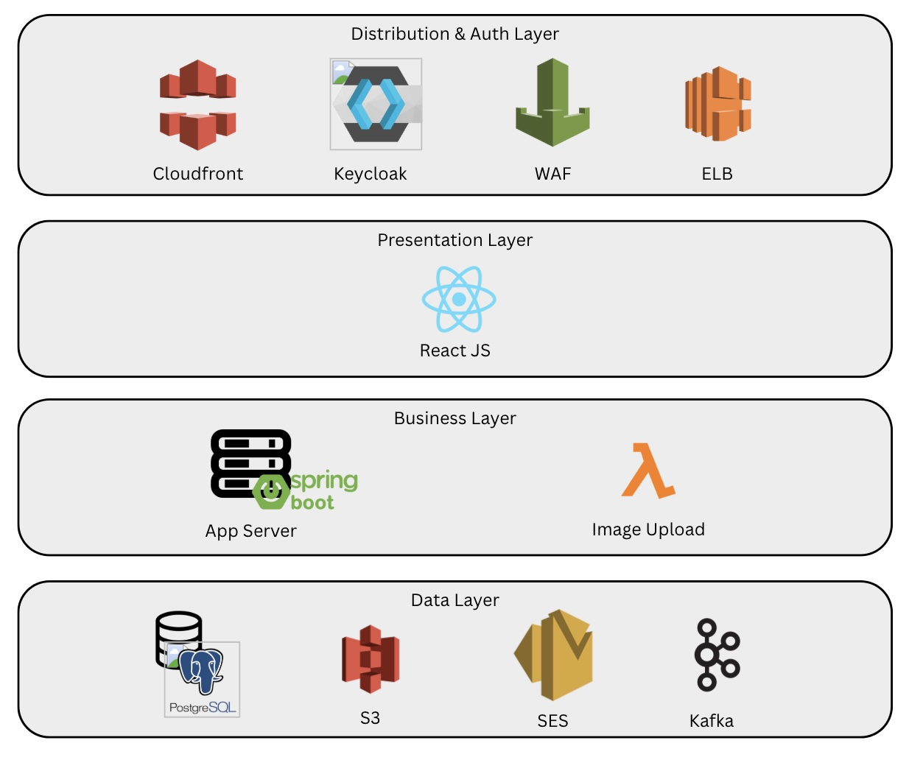
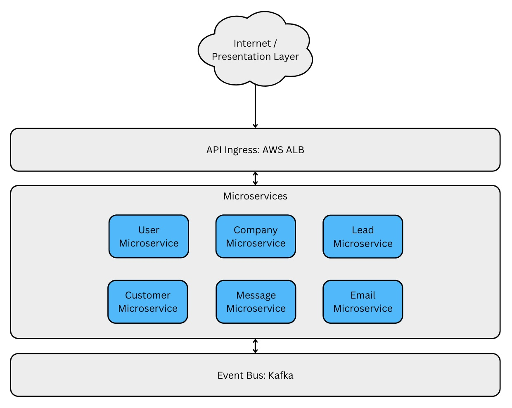

# Waitque 
Version 1: App allowing home/business-service companies to schedule work orders via customer contextualized QR codes

Reference to [User Stories](https://github.com/users/rahul5000000/projects/1/views/1).

## Purpose
The purpose of this app is to allow home/business-service companies to reduce the barrier for their customers to schedule work orders by providing each of their customers with printed materials with a custom QR that is mapped to that customer’s basic information like name, address, phone number, etc.

This allows for a streamlined process for the company’s customers scheduling a work order because only request pertinent information needs to be entered and customer context is automatically deduced via the custom QR code. The goal is that the streamlined scheduling process will increase the conversion of leads to work orders.

## Table of Contents
- [High-level Functional Design](#high-level-functional-design)
  - [Waitque User Personas](#waitque-user-personas)
  - [Happy Path Flow](#happy-path-flow)
  - [Technology Stack](#technology-stack)
- [Technical Design](#technical-design)
  - [Integrations](#integrations)
    - [Keycloak](#keycloak)
    - [AWS S3](#aws-s3-)
    - [AWS SES](#aws-ses)
    - [CRMs](#crms)
  - [Microservices](#microservices)
    - [User Microservice](#user-microservice)
    - [Company Microservice](#company-microservice)
    - [Lead Microservice](#lead-microservice)
    - [Customer Microservice](#customer-microservice)
    - [Message Microservice](#message-microservice)
    - [Email Microservice](#email-microservice)
  - [Lambdas](#lambdas)
  - [Database](#database)
    - [Entity Relationship Diagram](#entity-relationship-diagram-for-all-microservices)

## High-level Functional Design
### Waitque User Personas
- Super User - Waitque Admin User
  - Create / manage companies
  - Create / manage company admin & field users 
- Company Admin - Admin user for the home/business-service company 
  - Manage company configuration 
  - Create / manage lead flows 
  - View / convert leads 
  - Read messages 
  - Create / manage company field users 
  - Batch create Waitque QR codes 
- Company Field User - Field user for the home/business-service company 
  - Create / manage customer 
  - Associate Waitque QR code to customer 
- Customer - Home / Business Owner; scans QR code to initiate streamlined scheduling process 
  - Create / manage lead 
  - Send message
### Happy Path Flow

### Technology Stack

## Technical Design
### Integrations
#### Keycloak
Manages identity and access management for Waitque. Both the Spring Boot app server and serverless infrastructure trust the Keycloak JWT for user authentication. Keycloak is self-hosted by Waitque in a Kubernetes container. 
#### AWS S3 
Stores images (logos, photos, etc.) uploaded through Waitque via the image upload lambda. 
#### AWS SES
Sends email communications from Waitque to company admin users, company field users and customer users.
#### CRMs
Waitque will provide an integration with the native Waitque CRM. In the future Waitque will integrate with 3rd-party CRMs such as ServiceTitan, Salesforce, Hubspot, etc. so that customers can be created/located directly in the integrated 3rd-party CRM via Waitque.
### Microservices
Waitque’s business layer is implemented via domain specific Spring Boot microservices that run in Kubernetes containers and integrate synchronously via REST APIs or asynchronously via a Kafka event bus architecture.

#### User Microservice
_Purpose:_ Exposes REST APIs for creating / managing Waitque users. Integrates with Keycloak for user management, but encapsulates and abstracts Keycloak integration details.

Requests to create / manage company admin users and company field users are routed to this microservice.

_Persistence:_ None; all data is stored in Keycloak.

_Event Bus Integrations:_
- Publishes user created messages
- Publishes user updated messages
- Publishes user deactivated messages
- Subscribes to company deactivated messages
#### Company Microservice
_Purpose:_ Exposes REST APIs for creating / managing / retrieving companies, their configuration and QR codes.

Requests to create / manage / retrieve companies are routed to this microservice, as are requests to create / manage / retrieve lead flows. New unassigned QR codes are also generated by this service. Super users, company admins, company field users and customers all interact with this service.

_Persistence:_ Postgres Database

_Event Bus Integrations:_
- Publishes company created messages
- Publishes company updated messages
- Publishes company deactivated messages
#### Lead Microservice
_Purpose:_ Exposes REST APIs for creating / managing / retrieving leads. Company admins and customers are the primary users to interact with this service.

_Persistence:_ Postgres Database

_Event Bus Integrations:_
- Publishes lead created messages
- Publishes lead converted messages
#### Customer Microservice
_Purpose:_ Exposes REST APIs for creating customers & searching for customers in the integrated CRM and associating customers from the CRM to a unique QR code.

This service will have the ability to integrate with multiple CRMs in the future (ex. ServiceTitan, Salesforce, Hubspot, etc.), but currently only the native Waitque CRM is supported. This service encapsulates and abstracts the concrete CRM integration of each customer so that the other Waitque microservices are agnostic to the specific CRM implementation.

Requests to create / manage customers are routed to this microservice, as are requests to associate customers to QR codes. Company field users are the primary users of this microservice.

_Persistence:_ CRM (customers), Postgres Database (customer - QR code association)

_Event Bus Integrations:_
- Publishes customer created messages
- Publishes customer associated messages
#### Message Microservice
_Purpose:_ Exposes REST APIs for creating / managing / retrieving messages. Company admins and customers are the primary users of this service.

_Persistence:_ Postgres Database

_Event Bus Integrations:_
Publishes message created messages
Publishes message read messages
#### Email Microservice
_Purpose:_ Subscribes to Event Bus messages and triggers emails for the following scenarios:
- User Welcome Email
- User Updated Email
- User Deactivated Email
- Company Updated Email
- Company Deactivated Email
- Lead Created Email
- Lead Converted Email
- Message Created Email

_Persistence:_ Postgres Database (audit)
### Lambdas
Waitque functionality for image upload and processing is ideal for serverless AWS lambda implementation. This functionality will be implemented via Spring Cloud Functions to decouple from AWS specific functionality and will persist content to S3.

### Database
Waitque uses PostgresDB for persistence and [Flyway](https://www.red-gate.com/products/flyway/) for database migrations & version management. Flyway changesets are tracked in the same Github repository as the Waitque source code and are automatically deployed upon app startup.

Each microservice owns its data and, likewise, does not have direct access to another microservice’s data. However, for efficiency, all microservices share the database, but each microservice has its own access-controlled schema.

#### Entity Relationship Diagram for all Microservices
